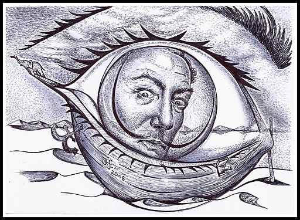

<!-- TEMPLATE COPY CONTENTS OF THIS FILE FOR NEW PROFILES-->

# Whole molecular damage (Hair)

<!-- {#fig-double-stranded-caricature} -->

_CARICATURE PLOT GOES HERE_

\newpage

```{r}
#| label: fig-template
#| fig-cap: Example of a smiley plot of a single stranded library from an ancient hair sample  with elevated C to T throughout the entire molecule. where the DNA received damage . Data taken from library KDR001.B0101 of [@Wang2022-mb]. Damage data generated using [DamageProfiler](/intro.qmd) and plotted using R and tidyverse packages [@Wickham2019-ot].
#| echo: false
#| warning: false
#| error: false

library(readr)
library(tidyr)
library(dplyr)
library(ggplot2)
library(patchwork)
source("assets/src/R/style.r")
source("assets/src/R/damage-profiler.r")
type_colours <- type_colours_dp

raw_5p <- readr::read_tsv("assets/data/whole-molecule-damage/5p_freq_misincorporations.txt", comment = "#")
raw_3p <- readr::read_tsv("assets/data/whole-molecule-damage/3p_freq_misincorporations.txt", comment = "#")


long_5p <- pivot_longer_freqmisincorporat(raw_5p, reverse = FALSE, type_colours = type_colours)
long_3p <- pivot_longer_freqmisincorporat(raw_3p, reverse = TRUE, type_colours = type_colours)

smiley_5p <- plot_longer_freqmisincorporat(long_5p, reverse = FALSE, type_colours)
smiley_3p <- plot_longer_freqmisincorporat(long_3p, reverse = TRUE, type_colours)

smiley_5p + smiley_3p

```

In this unusual smiley plot, we see elevated C to T misincorporation frequencies across the _entire_ span of the molecules (at around 10%), with the single-stranded library only presenting modest increases more than this in the first few nucleotides. This is contrast to our normal expectation of significantly increased frequencies only at the read termini.

Interestingly, this is not necessarily an invalid smiley plot. In this special case, the ancient DNA is in fact unusually derived from an ancient hair sample.
@Wang2022-mb interpreted this damage pattern to be unique to sample types like hair, that contain DNA that have already undergone extensive and accelerated fragmentation and damage from sunlight radiation during the life of the individual.
This is particularly the case for the DNA from this individual, as the individual lived in Sudan, Africa, a region that long periods of intense sunlight.
Furthermore, the dry and arid environment may have reduced enzymatic activity and hydrolytic reactions that is the typical mechanism for causing the damage at the molecular termini [@Wang2022-mb]. 

This exceptional damage is also reflected in the shorter-median fragment length of the library, with a significant number of molecules being shorter than an equivalent bone sample [@Wang2022-mb], as well the C to T misincorporation frequencies elevated at both the 5p and 3p ends (rather than G to A in the 3p), as to be expected from [single-stranded libraries](single-stranded.qmd).

Despite the unusual damage pattern, after reducing typical read-length filters of 30bp to 25bp, the authors obtained extremely low-coverage data, which were however sufficient to place the individual into regional ancestry within Eastern Africa using routine human population genetics analysis.